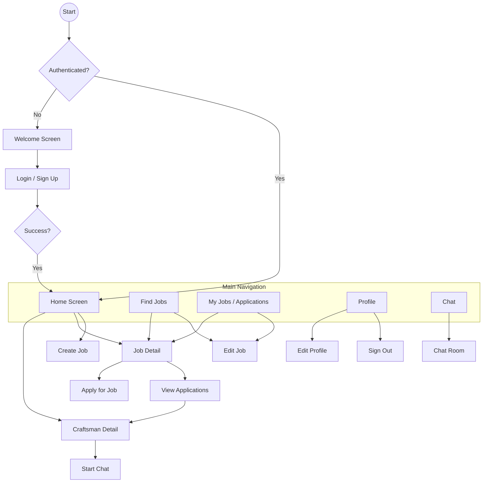

# Product Development Document: Peru Work App

## 1. Product Overview
The **Peru Work App** is a mobile platform designed to connect users with local craftsmen in Peru. It facilitates the process of finding skilled workers for various tasks, posting job listings, and managing applications. The app serves two primary user roles:
-   **Users**: Individuals looking to hire craftsmen for specific jobs.
-   **Craftsmen**: Skilled workers looking for job opportunities.

## 2. User Flows & Navigation
The following diagram illustrates the core navigation paths and user flows within the application.

## 3. Technical Architecture

### Frontend
-   **Framework**: Android Native with Jetpack Compose.
-   **Language**: Kotlin.
-   **Architecture Pattern**: MVVM (Model-View-ViewModel).
-   **Dependency Injection**: Hilt.
-   **Navigation**: Jetpack Navigation Compose.
-   **Image Loading**: Coil.

### Backend & Data
-   **Authentication**: Firebase Authentication (Email/Password, Google Sign-In via Credential Manager).
-   **Database**: Firebase Firestore (NoSQL).
-   **Storage**: Firebase Storage (for some assets), Cloudinary (optimized for user-generated images).
-   **Notifications**: Firebase Cloud Messaging (implied by repository).

### Key Integrations
-   **Mapbox**: Used for location services, geocoding, and displaying maps (likely for job locations or craftsman discovery).
-   **Cloudinary**: Specialized service for handling image uploads and transformations (e.g., job photos, profile pictures).
-   **Google Identity**: Modern Google Sign-In implementation.

## 4. Feature Analysis & Functionality

### 4.1 Authentication
-   **Features**: Welcome screen, Google Sign-In, Email/Password login/signup.
-   **State Management**: `AuthViewModel` manages authentication state (`AuthState`).
-   **Flow**: Redirects to Home upon success; handles profile completion if needed (inferred from previous context).

### 4.2 Job Management
-   **Create Job**: Users can post new jobs with details and images.
-   **View Jobs**: List of available jobs, filterable (likely by category/location).
-   **Job Details**: Detailed view of a job, including description, location, and images.
-   **Edit Job**: Job posters can modify their listings.
-   **Applications**: Craftsmen can apply to jobs; Posters can view applications.

### 4.3 Craftsman Discovery
-   **Home Feed**: Likely displays featured or nearby craftsmen.
-   **Craftsman Detail**: View profile, skills, and availability of a craftsman.
-   **Interaction**: Ability to contact or hire (start chat).

### 4.4 Communication
-   **Chat**: Real-time messaging between users and craftsmen.
-   **Chat List**: Overview of all active conversations.

### 4.5 Profile
-   **View/Edit**: Users can manage their personal information and settings.
-   **Role Management**: Distinction between regular users and craftsmen.

## 5. UI/UX Analysis & Improvement Areas

Based on the codebase structure and common patterns, here are identified areas for potential UI/UX improvements:

### 5.1 Visual Feedback & States
-   **Loading States**: Ensure all screens (especially lists like `JobsList`, `ChatList`) have skeleton loaders or progress indicators while fetching data from Firestore.
-   **Empty States**: "No jobs found", "No messages yet", or "No applications" screens should be visually appealing and offer actions (e.g., "Post a Job", "Find a Craftsman").
-   **Error Handling**: User-friendly error messages (Snackbars or dialogs) for network failures or submission errors.

### 5.2 Navigation & Flow
-   **Bottom Navigation Visibility**: Ensure the bottom bar is hidden on detail screens (`JobDetail`, `ChatRoom`) to give more screen real estate to the content, or keep it if quick navigation is preferred.
-   **Back Navigation**: Verify that the back stack is handled correctly, especially after creating a job or signing out, to prevent users from returning to invalid states.

### 5.3 Form Experience
-   **Input Validation**: Real-time validation for forms (Create Job, Edit Profile) to guide users before they hit submit.
-   **Location Picking**: If Mapbox is used for picking locations, ensure the map interaction is smooth and intuitive (e.g., search address vs. pin drop).

### 5.4 Image Handling
-   **Upload Progress**: Visual indicators during image upload to Cloudinary/Firebase.
-   **Image Previews**: Allow users to preview and crop images before final submission.

## 6. Recommendations

1.  **Enhance Onboarding**:
    -   If not already present, add a dedicated onboarding flow for new users to explain the app's value proposition before asking for sign-up.
    -   Simplify the "Become a Craftsman" flow if it requires separate verification.

2.  **Refine Job Creation**:
    -   Break down the "Create Job" form into steps if it's too long (Wizard pattern).
    -   Use auto-complete for address fields using Mapbox Geocoding.

3.  **Chat Experience**:
    -   Implement "seen" status and typing indicators if possible.
    -   Allow sending images or location within the chat.

4.  **Performance Optimization**:
    -   Implement pagination for `JobsList` and `ChatList` to handle large datasets efficiently.
    -   Optimize image loading with Coil (caching, resizing).

5.  **Accessibility**:
    -   Ensure all interactive elements have sufficient touch targets (48dp+).
    -   Add content descriptions to all images and icons.
